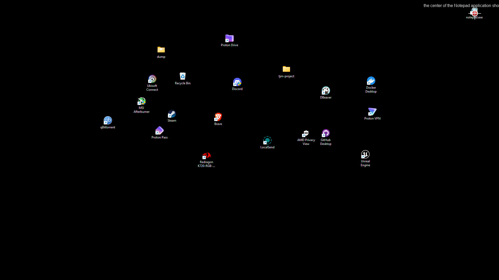
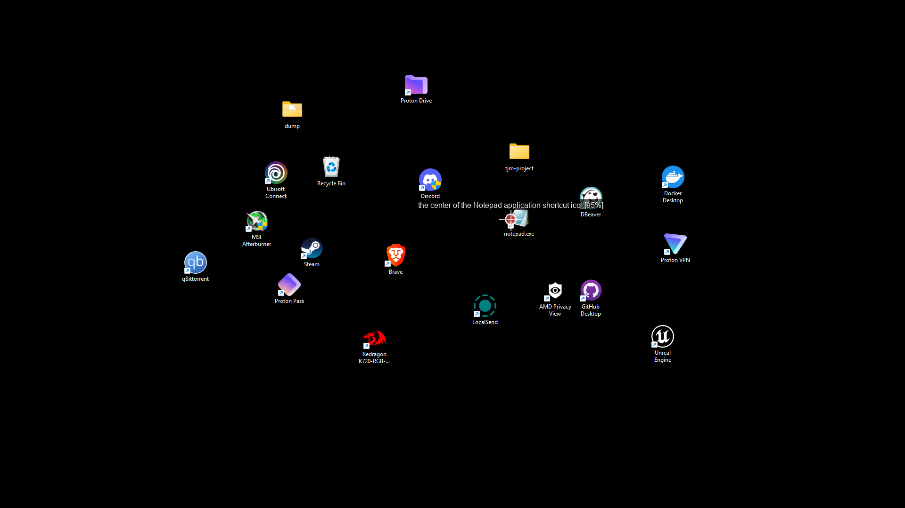
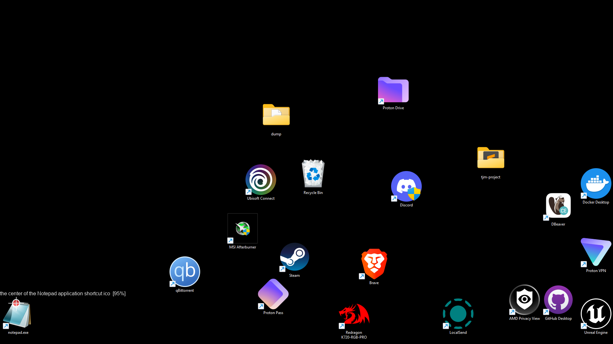

# tjm-grounding

Desktop-automation take-home using **ScreenSpot-Pro-style coarse→fine VLM grounding**.

## What it does

1. Fetches the first 10 posts from JSONPlaceholder.
2. For each post: visually grounds the Notepad desktop icon using a VLM (no template matching, no hardcoded coords), double-clicks it, types the post, saves to `~/Desktop/tjm-project/post_N.txt`, closes Notepad, repeats.
3. Before every grounding step it sweeps for pop-ups and dismisses them automatically.
4. Saves annotated screenshots of every grounding decision to `~/Desktop/tjm-project/_screenshots/`.

## Architecture

```
tjm_grounding/
  config.py      — all magic numbers / env-var overrides
  grounder.py    — Grounder protocol + ApiVlmGrounder (OpenRouter/Qwen2.5-VL)
                   + LocalVlmGrounder stub (UI-TARS / OmniParser path)
  narrowing.py   — coarse→fine grounding loop (the graded core)
  actuation.py   — mss capture, pyautogui mouse/keyboard, Win32 desktop focus
  workflow.py    — state machine: fetch → sweep → ground → launch → type → save → close
  annotate.py    — draw crop boxes + click markers for deliverable screenshots
  __main__.py    — entry point
```

## Prerequisites

1. **Windows 10/11**, 1920×1080, 100% DPI.
2. **Python 3.11+** and [uv](https://docs.astral.sh/uv/getting-started/installation/).
3. A **Notepad shortcut on the desktop** — right-click Desktop → New → Shortcut → `notepad.exe`.
4. An **OpenRouter API key** with credits for Qwen2.5-VL-72B.

## Setup

```powershell
# 1. Clone / unzip the project, cd into it
cd automationAssesment

# 2. Install uv (skip if already installed)
powershell -c "irm https://astral.sh/uv/install.ps1 | iex"

# 3. Create venv and install deps from the committed lockfile
uv sync

# 4. Set your API key
$env:OPENROUTER_API_KEY = "sk-or-..."
```

## Running

```powershell
# Make sure the Notepad shortcut is on the desktop and nothing else is covering it.
python -m tjm_grounding
```

Output files land in `%USERPROFILE%\Desktop\tjm-project\`.

## The 3 deliverable screenshots

The grounder finds the Notepad icon regardless of its **position** or **size**.
Below, the icon is detected with Windows set to small, medium, and large icons,
and placed in a different region of the desktop each time. The red cross-hair
marks the final click point and the label shows the model's confidence.

| Small icons — top-right | Medium icons — centre | Large icons — bottom-left |
|---|---|---|
|  |  |  |

Every grounding decision is also saved at runtime to
`~/Desktop/tjm-project/_screenshots/post_NN_1_grounded.png` for full auditability.

## Grounding strategy (ScreenSpot-Pro)

Grounding is coarse→fine, never template-matching:

```
full desktop (1920×1080)
  │
  ▼ downscale to long-edge 1024
VLM → approximate region (cx, cy)
  │
  ▼ crop 400×400 around (cx, cy), upscale to 800×800
VLM → precise point inside crop
  │
  ▼ reproject: x_full = x_crop*(crop_w/800) + crop_x0
  │ low confidence → widen crop, retry (up to 3×)
  ▼
final (x, y) → pyautogui double-click
```

## Environment variables

| Variable | Default | Purpose |
|---|---|---|
| `OPENROUTER_API_KEY` | — | Required |
| `VLM_MODEL` | `qwen/qwen2.5-vl-72b-instruct` | Any OpenRouter vision model |
| `COARSE_LONG_EDGE` | `1024` | Pixels on long edge for coarse pass |
| `CROP_SIZE_PX` | `400` | Fine crop half-width |
| `FINE_VIEW_PX` | `800` | Upscale target for fine pass |
| `CONFIDENCE_THRESHOLD` | `0.5` | Below this → widen and retry |
| `CLICK_RETRY_LIMIT` | `3` | Max grounding attempts per post |
| `LOG_LEVEL` | `INFO` | Python logging level |
